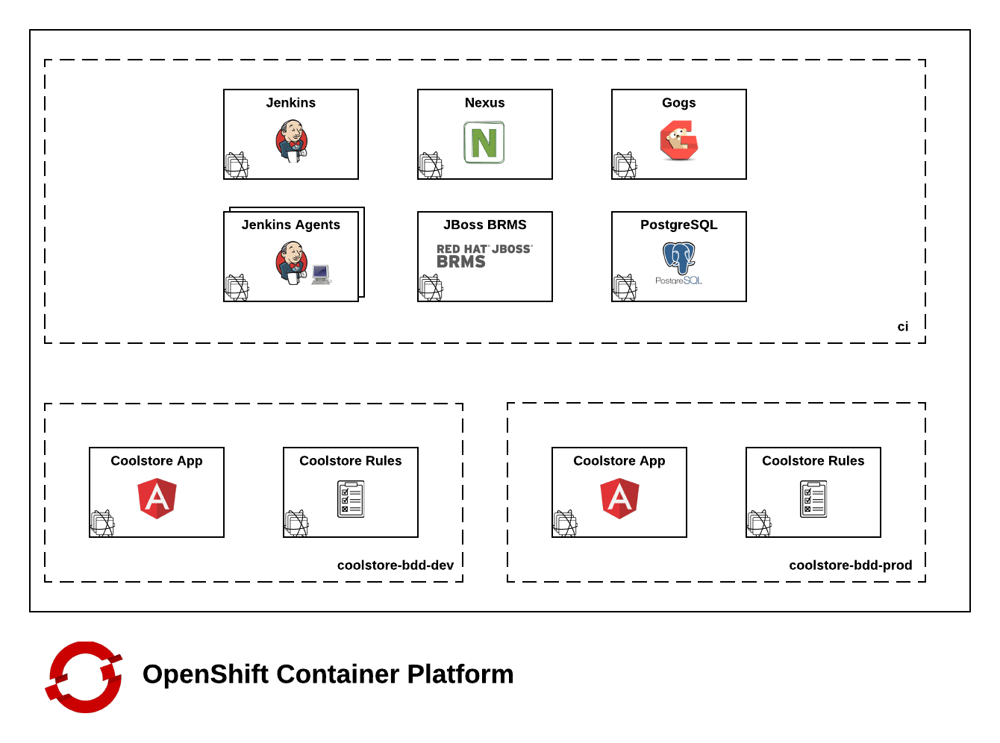

OpenShift Environment
==================

The OpenShift Container Platform is used as the execution environment. This document describes how each of the components are organized and configured within the OpenShift cluster 

# Projects

Projects in an OpenShift environment are a mechanism to logically separate components within the cluster. The use of projects allows administrators and users to restrict components at a networking and access levels.

The cluster is split into the following projects to provide this level of isolation:

* ci - Contains the infrastructure components to run the continuous integration, continuous delivery and business rules. 
* coolstore-bdd-dev - Development environment containing the rules service and user interface
* coolstore-bdd-prod - Production environment containing the rules service and user interface

The following diagram depicts the configuration of projects and their components within OpenShift

# Access

To provide for a secure environment, control mechanisms are in place to restrict access to components within the OpenShift cluster.

Access to the OpenShift cluster is defined using two methods: [Regular users](https://docs.openshift.com/enterprise/latest/architecture/core_concepts/projects_and_users.html#users) and [Service Accounts](https://docs.openshift.com/enterprise/latest/dev_guide/service_accounts.html).

Regular users are defined based on the *identity provider* defined in the OpenShift Master *master-config.yaml* file.

Service accounts in OpenShift are non user account that are given access to the API to perform functions within the cluster. 

A service account has been created for Jenkins to allow query resources in the OpenShift cluster. As part of the initial setup, this *jenkins* service account was granted permission on both the *ci* project as well as each of the application environment projects. This allows for Jenkins to dynamically spawn agents based on load as well as promote applications between various deployment environments.

# Intra-Cluster Application Communication

Applications within the OpenShift cluster communicate with each other by way of [Kubernetes Services](https://docs.openshift.com/enterprise/latest/architecture/core_concepts/pods_and_services.html#services). Service names are resolved automatically by the [DNS capabilities](https://docs.openshift.com/enterprise/latest/architecture/additional_concepts/networking.html#openshift-enterprise-dns) found within OpenShift. 

*Note: It is assumed that the cluster supports communication between different projects at a network layer. Since the OpenShift environment uses the *ovs-subnet* plugin by default, services can communicate with each other over the OpenShift software defined network. If the ovs-multitenant plugin was installed, the `oadm pod-network join-projects` command can be used to join the *ci* project with each of the deployment environment projects.*